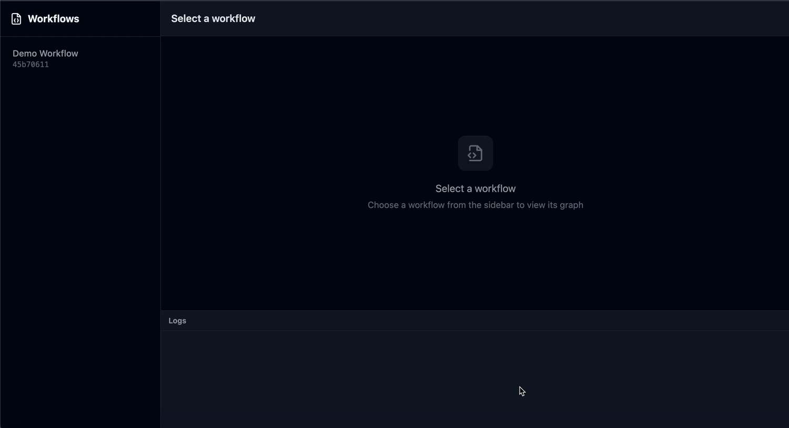

# Stepforge

**Stepforge** is a code-first workflow runner for developers.

It lets you define operational workflows in **TypeScript**, automatically visualize them as a step graph, and run them from a local UI with live progress, logs, retries, and status.

Workflows are written as normal async code.  
The structure is inferred and rendered automatically.

**No YAML. No visual editors. Code is the source of truth.**



## Why Stepforge?

Engineers often rely on ad-hoc scripts and runbooks to:

- test integrations
- orchestrate AWS services
- provision or configure infrastructure
- run operational or setup tasks

These scripts work, but they’re hard to observe and harder to debug:

- no clear notion of steps
- no progress visibility
- failures are buried in logs
- retries and partial reruns are manual

Existing workflow tools usually require translating working code into
configuration files or rigid orchestration systems.

**Stepforge runs scripts _like workflows_, without turning them into systems.**

---

## What you get

- 🧠 **Code-first workflows** written in TypeScript
- 🧩 **Automatic step graph** derived from code
- ▶️ **Local UI** to run workflows and watch them execute
- 📊 **Live progress, logs, retries, and status**
- 🔁 **Map / loop support** with per-iteration visibility
- ✅ **Checks and assertions** for explicit validation
- 🧪 **Local-first** with zero infrastructure required

---

## How it works (high level)

Stepforge is shipped as a **single package**, but internally has three clear responsibilities.

### 1. Workflow definition (TypeScript)

Workflows live in `.forge.ts` files and use a small SDK.

```ts
import { workflow } from "stepforge";

export default workflow("Example", (wf) => {
  wf.step("First step", async (ctx) => {
    ctx.log.info("Hello");
  });

  wf.step("Second step", async (ctx) => {
    ctx.log.info("World");
  });
});
```

Steps are declared directly in code.
There is no separate graph definition.

---

### Typed inputs (optional)

Workflows can declare typed inputs that automatically power the UI and CLI.

```ts
import { workflow, inputs } from "stepforge";

export default workflow(
  "Example",
  inputs([
    {
      name: "count",
      type: "number",
      label: "Count",
      default: 5,
    },
  ]),
  (wf) => {
    wf.step("Process", async (ctx) => {
      ctx.log.info(`Count: ${ctx.inputs.count}`);
    });
  }
);
```

Inputs are:

- strongly typed
- validated at runtime
- editable in the UI before each run

---

### 2. Local daemon (planning + orchestration)

Run Stepforge against a directory of workflows:

```bash
npx stepforge ./workflows
```

Stepforge will:

- scan the directory for `*.forge.ts` files
- load workflows in **plan mode** to build a static step graph
- serve a local UI
- let you start workflow runs on demand

The graph is built **before execution** and reused during runs, ensuring
stable node identities and predictable visualization.

---

### 3. Runner (execution + events)

When a workflow is run:

- it executes in an isolated Node.js process
- steps emit structured runtime events (start, logs, retries, end)
- events are streamed back to the UI in real time

Because node IDs are stable, runtime events map directly onto the pre-built graph.

---

## Key design principles

- **Code is the source of truth**
- **Graphs are derived, never authored**
- **Execution is observable by default**
- **Retries, checks, and loops are first-class**
- **No side effects at import time**
- **Local-first and developer-friendly**

---

## Status

Stepforge is currently **experimental**.

The architecture is intentionally simple and designed to evolve toward:

- run history and inspection
- resumable and partial reruns
- parallel execution
- richer artifacts and outputs

Feedback, ideas, and contributions are very welcome.

---

## License

MIT

